# PythonAQ

[](https://github.com/chris-r-uol/PythonAQ/actions/workflows/tests.yml)
[](https://www.python.org)
[](LICENSE)

Air quality data analysis and visualisation for Python, following the R
[openair](https://github.com/openair-project/openair) package. Download data
from the UK monitoring networks and NOAA, average and condition it properly,
and produce interactive Plotly figures.

<p align="center">
  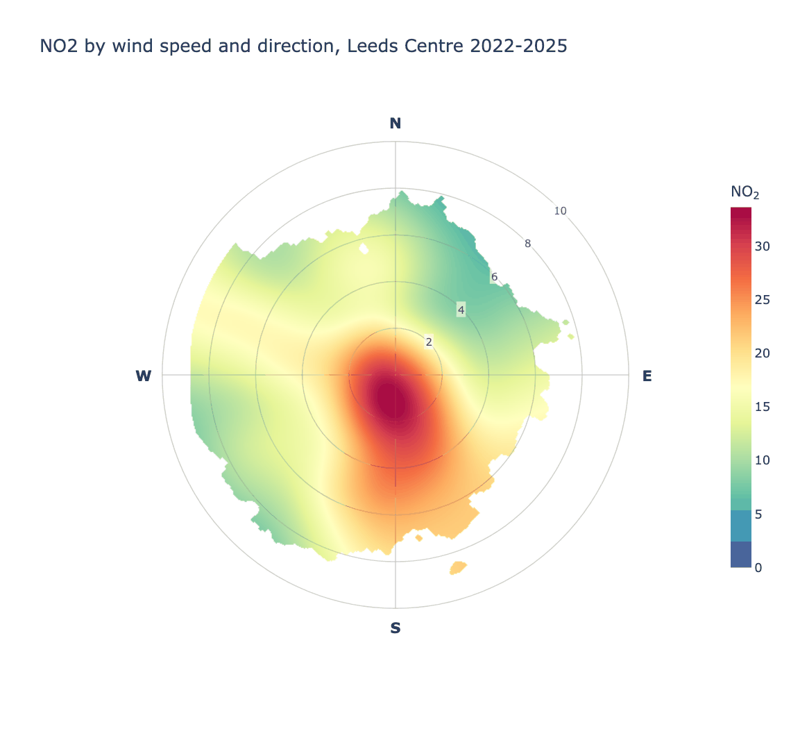
</p>

Every figure in this manual is generated by
[`examples/build_readme_figures.py`](examples/build_readme_figures.py) from real
AURN data for Leeds Centre, 2022–2025 — so what you see is what the package
actually renders.

---

## Contents

- [Installation](#installation)
- [Quick start](#quick-start)
- [Getting data](#getting-data)
- [Directional analysis](#directional-analysis) — how concentrations relate to wind
- [Time series and trends](#time-series-and-trends)
- [Distributions and relationships](#distributions-and-relationships)
- [Model evaluation](#model-evaluation)
- [Data utilities](#data-utilities)
- [Meteorological helpers](#meteorological-helpers)
- [Relationship to openair](#relationship-to-openair)
- [Worked example](#worked-example)
- [Development](#development)
- [Licence](#licence)

---

## Installation

```bash
git clone https://github.com/chris-r-uol/PythonAQ.git
cd PythonAQ
pip install -e .
```

The package is then importable from anywhere:

```python
from PythonAQ import import_aq_meta, wind_rose
```

### Optional extras

Some features carry dependencies deliberately kept out of the core install:

```bash
pip install -e '.[calendar]'  # the calendar plot
pip install -e '.[app]'       # the Streamlit demo application
pip install -e '.[dev]'       # test and lint tooling
pip install -e '.[docs]'      # static image export, for rebuilding this manual
```

> **A caveat on the `calendar` extra.** It needs `plotly-calplot`, which pins
> `numpy<2` and `plotly<6` and does not work on pandas 3. Installing it will
> constrain the rest of your environment, which is why `calendar` is the only
> function unavailable from a plain `pip install -e .` — and why it raises a
> helpful `ImportError` rather than failing at import time.

### Dependencies

Python 3.9+, with numpy, pandas, scipy, plotly, requests, rdata,
scikit-learn, statsmodels, pymannkendall and pygam.

---

## Quick start

```python
from PythonAQ import download_aurn_data, polar_plot, time_variation

# Four years of hourly data for Leeds Centre
df = download_aurn_data('LEED', 2022, 2025, 'aurn')

polar_plot(df, conc_col='NO2').show()
fig, summary = time_variation(df, 'NO2')
fig.show()
```

Most plotting functions return a Plotly `Figure`. Several also return a
`DataFrame` of the values behind the plot, so you can check or reuse the
numbers rather than reading them off a chart.

---

## Getting data

### `import_aq_meta`

Site metadata for a UK monitoring network.

```python
from PythonAQ import import_aq_meta

metadata = import_aq_meta('aurn')
```

- `source` (str): `'aurn'`, `'saqn'`, `'aqe'`, `'waqn'` or `'ni'`.

Returns a `DataFrame` with `site_id`, `site_name`, `location_type`, latitude,
longitude, `zone`, `local_authority` and operating dates.

### `download_aurn_data`

Hourly observations for one site across a range of years.

```python
from PythonAQ import download_aurn_data

df = download_aurn_data(site='LEED', start_year=2022, end_year=2025, source='aurn')
```

- `site` (str), `start_year` (int), `end_year` (int), `source` (str).

Returns a combined `DataFrame`, one row per hour, with a `date_time` column and
whichever pollutants the site measures.

### `download_noaa_data` and `parse_noaa_data`

Meteorology from NOAA's Integrated Surface Database.

```python
from PythonAQ import download_noaa_data

met = download_noaa_data(station_code='033440-99999', year_start=2022, year_end=2025)
```

`parse_noaa_data` does the decoding and is called for you by
`download_noaa_data`; call it directly if you have raw ISD CSVs. It splits the
packed comma-separated fields, clears the documented missing-value sentinels
*before* applying the ×10 scaling, resamples to hourly means, and derives
relative humidity.

Returns `air_temp` (°C), `ws` (m/s), `wd` (degrees), `dew_point` (°C),
`atmospheric_pressure` (hPa) and `relative_humidity` (%).

### `map_sites`

Locate monitoring sites.

<p align="center">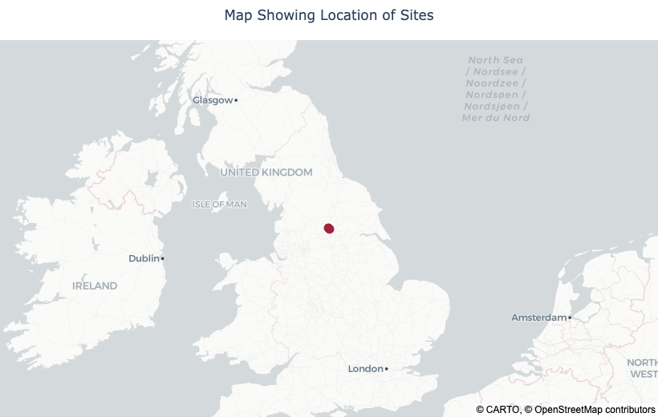</p>

```python
from PythonAQ import map_sites

map_sites(metadata, sites=['LEED', 'LED6']).show()
```

---

## Directional analysis

How concentrations vary with wind speed and direction — the most direct way to
ask where pollution is coming from.

### `polar_plot`

Concentration as a function of both wind speed (radius) and direction, smoothed
with a tensor-product GAM.

<p align="center"></p>

```python
from PythonAQ import polar_plot

polar_plot(df, conc_col='NO2').show()
```

Reading this one: NO₂ at Leeds Centre — an urban background site — peaks at the
centre of the plot, at *low* wind speeds, the signature of nearby ground-level
sources accumulating under calm conditions rather than of a single distant
stack. Concentrations stay elevated towards the south and south-west, and fall
away to the north-east at higher wind speeds where cleaner air dilutes them.

**Parameters**

- `conc_col` (str): concentration column.
- `render` (str): `'raster'` (default) draws one continuous surface,
  `'contour'` filled bands, `'tile'` the original one-polygon-per-bin rendering.
- `resolution` (int): grid points per axis, default 300. Higher is smoother and
  slower.
- `ws_limit` (str or float): radial extent. `'auto'` (default) uses the 99th
  percentile of wind speed, `'max'` the full observed range, or give a number.
- `min_count` (int): minimum observations per bin, and the local density
  required for a grid cell to be drawn.
- `exclude_missing` (bool), `exclude_distance` (float): blank grid areas too far
  from any observation, rather than extrapolating into empty sectors.
- `uncertainty` (float): confidence width, e.g. `0.95`, for blanking regions
  where the prediction interval exceeds the prediction.
- `upper_limit` (float): blank predictions above this concentration.

**On rendering.** The surface is predicted onto a regular Cartesian grid in
wind-component space and drawn as a single interpolated raster, which is what
openair does via lattice's `levelplot`.

```python
polar_plot(df, conc_col='NO2', render='contour').show()
```

<p align="center">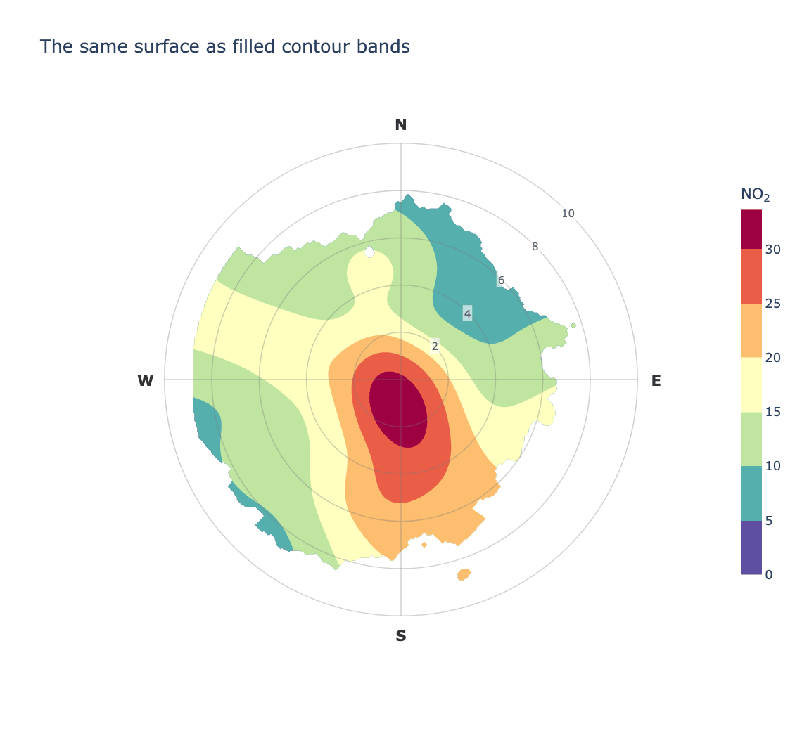</p>

The old behaviour is still available, and shows why the default changed —
drawing one flat-filled polygon per bin looks blocky however smooth the
underlying fit is, because nothing interpolates between neighbouring cells:

```python
polar_plot(df, conc_col='NO2', render='tile').show()
```

<p align="center">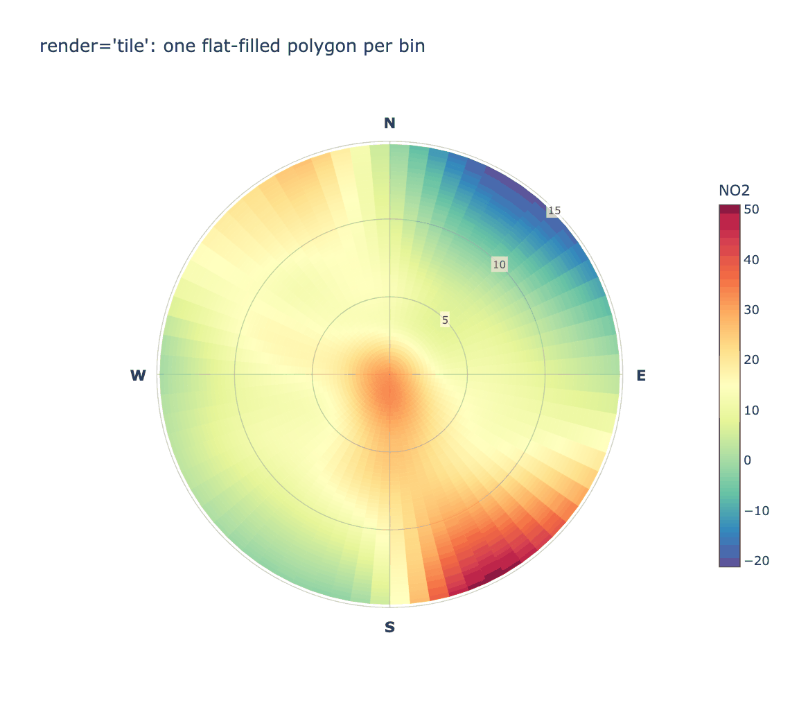</p>

### `wind_rose`

Wind speed and direction distribution.

<p align="center">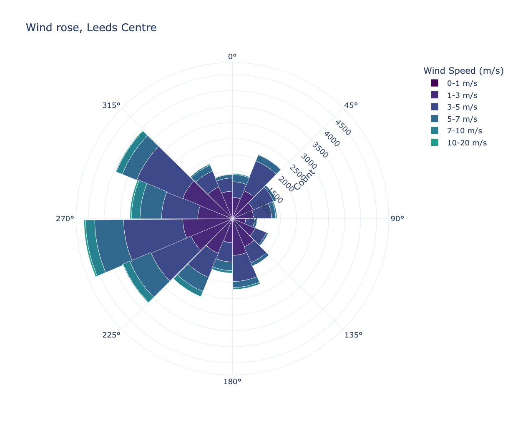</p>

```python
from PythonAQ import wind_rose

fig, summary = wind_rose(df, group_by='none')
```

- `group_by` (str): `'none'`, `'year'` or `'quartile'`.
- `quartile_col` (str): column to split on when `group_by='quartile'`.
- `mode` (str): `'count'` or `'percentage'`.
- `direction_bins` (int), `speed_bins` (list): binning.

Returns the figure and a summary `DataFrame`.

### `pollutant_rose`

Concentration by wind direction, banded by concentration.

<p align="center">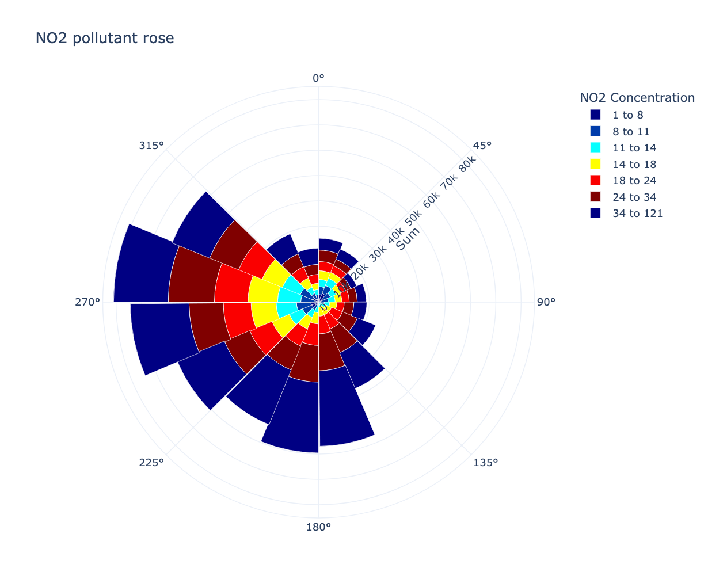</p>

```python
from PythonAQ import pollutant_rose

fig, summary = pollutant_rose(df, pollutant='NO2')
```

### `percentile_rose`

How the *distribution*, not just the mean, varies with direction. Useful when a
source only shows up in the tail.

<p align="center">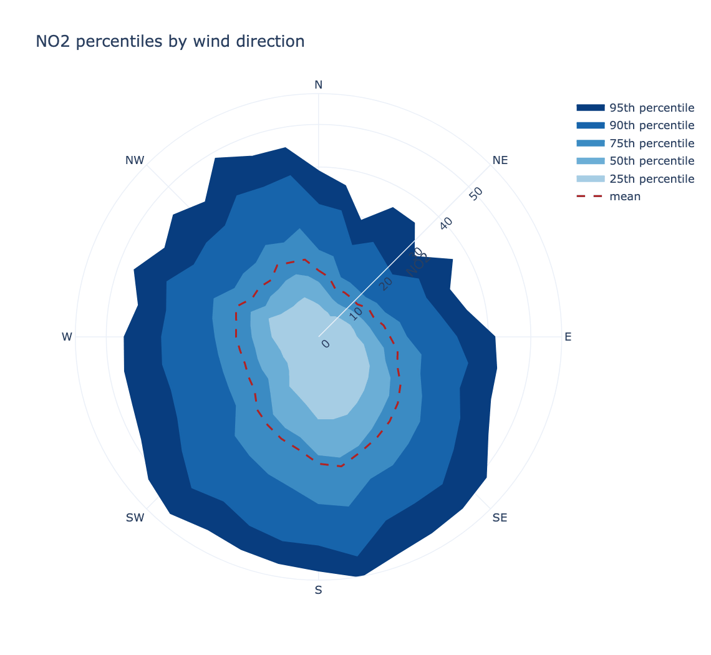</p>

```python
from PythonAQ import percentile_rose

fig, summary = percentile_rose(df, 'NO2', percentile=[25, 50, 75, 90, 95])
```

- `percentile` (sequence): percentiles to draw.
- `direction_bins` (int): wind direction sectors, default 36.
- `fill` (bool), `mean_line` (bool): styling.

### `polar_frequency_plot`

How often each wind speed and direction combination occurs — worth checking
alongside `polar_plot`, since a striking feature in a sector with almost no data
is not a finding.

<p align="center">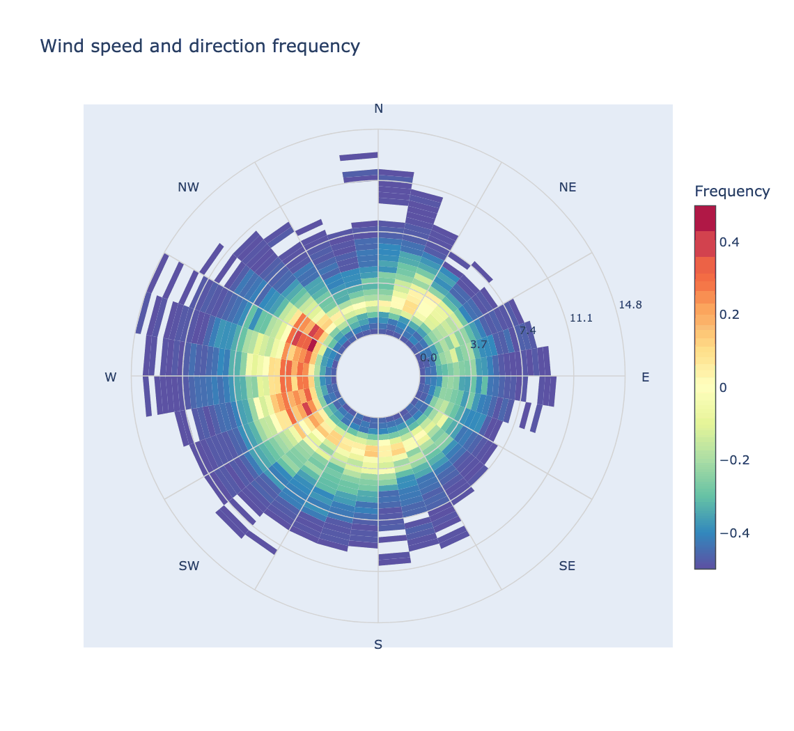</p>

```python
from PythonAQ import polar_frequency_plot

polar_frequency_plot(df, separate_by_year=False).show()
```

### `polar_cluster`

K-means clustering in polar coordinates, to group conditions that behave alike.

<p align="center">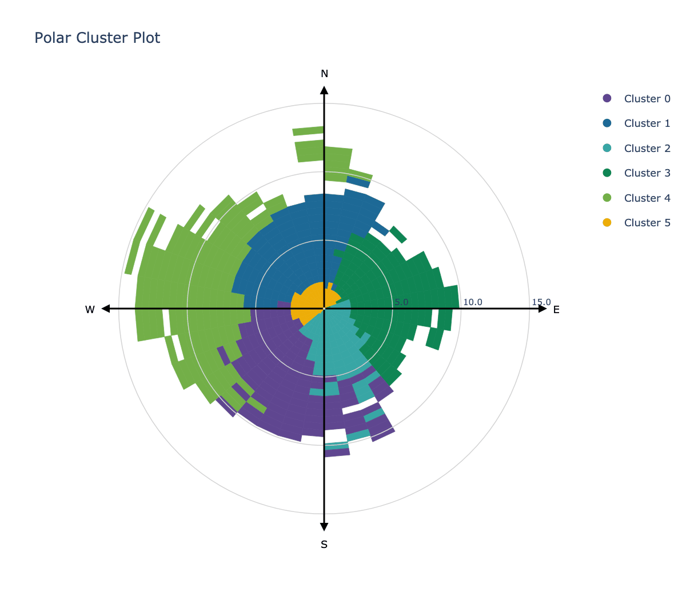</p>

```python
from PythonAQ import polar_cluster

polar_cluster(df, feature_cols=['NO2', 'PM10', 'O3'], n_clusters=6).show()
```

---

## Time series and trends

### `time_variation`

The four-panel temporal summary: hour of day split by weekday, day of week,
hour of day, and month of year, each with bootstrap confidence intervals.

<p align="center">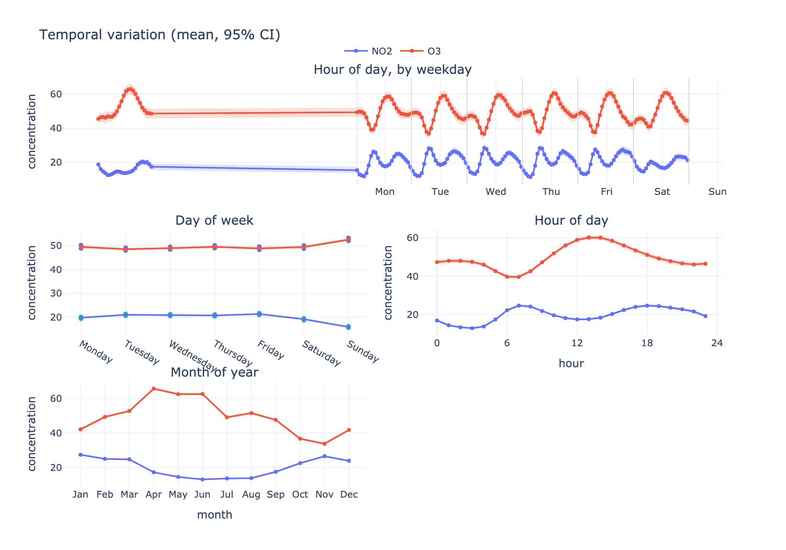</p>

```python
from PythonAQ import time_variation

fig, summary = time_variation(df, ['NO2', 'O3'], random_state=42)
```

At Leeds Centre NO₂ peaks at **07:00**, runs about 3 µg/m³ lower at weekends,
and is roughly twice as high in winter as in summer. O₃ moves the opposite way
on all three axes, which is the expected titration relationship.

**Parameters**

- `pollutant` (str or list): one or more columns.
- `statistic` (str): `'mean'` or `'median'`.
- `conf_int` (float): confidence level, default `0.95`.
- `n_boot` (int): bootstrap replicates (openair's `B`), default 100.
- `normalise` (bool): divide each series by its mean, to compare shapes across
  variables on different scales.
- `ci` (bool): draw the confidence bands.
- `random_state` (int): seed, for reproducible intervals.

Returns the figure and a long-format `DataFrame` of every plotted statistic.

### `theil_sen_plot`

Non-parametric trend estimate with confidence intervals and a Mann-Kendall
significance test.

<p align="center">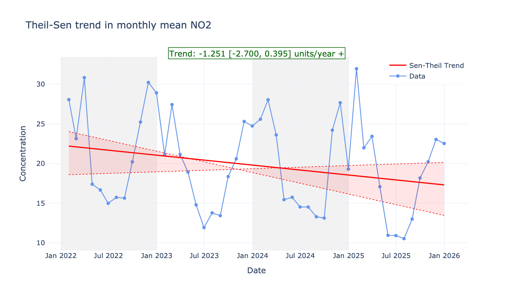</p>

```python
from PythonAQ import theil_sen_plot

theil_sen_plot(df, pollutant_col='NO2', agg_freq='ME').show()
```

- `agg_freq` (str): averaging period before fitting, e.g. `'ME'`.
- `deseason` (bool): remove the seasonal cycle via STL first.
- `alpha` (float): significance level.

### `smooth_trend_plot`

A GAM smooth rather than a straight line, for trends that are not monotonic.

<p align="center">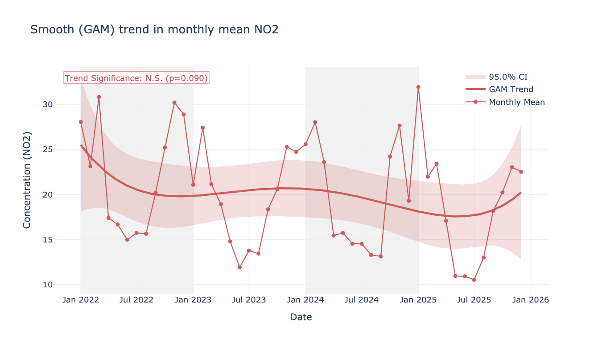</p>

```python
from PythonAQ import smooth_trend_plot

smooth_trend_plot(df, pollutant_col='NO2', avg_freq='MS').show()
```

### `time_plot`

Time series for one or more pollutants, with optional grouping, stacking and
normalisation.

<p align="center">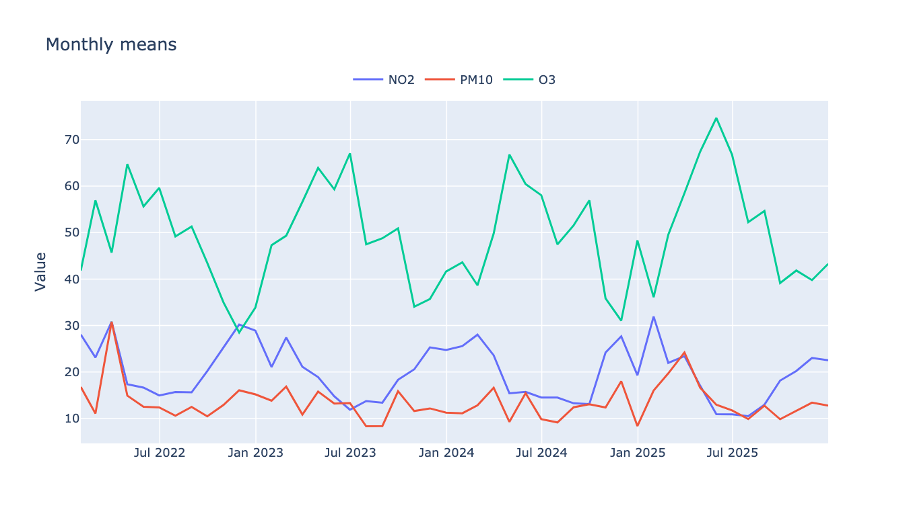</p>

```python
from PythonAQ import time_plot

time_plot(df, columns_to_plot=['NO2', 'PM10', 'O3'],
          averaging_period='ME', group_data=True).show()
```

### `trend_level`

A heat map over two time dimensions, split into panels by a third.

<p align="center">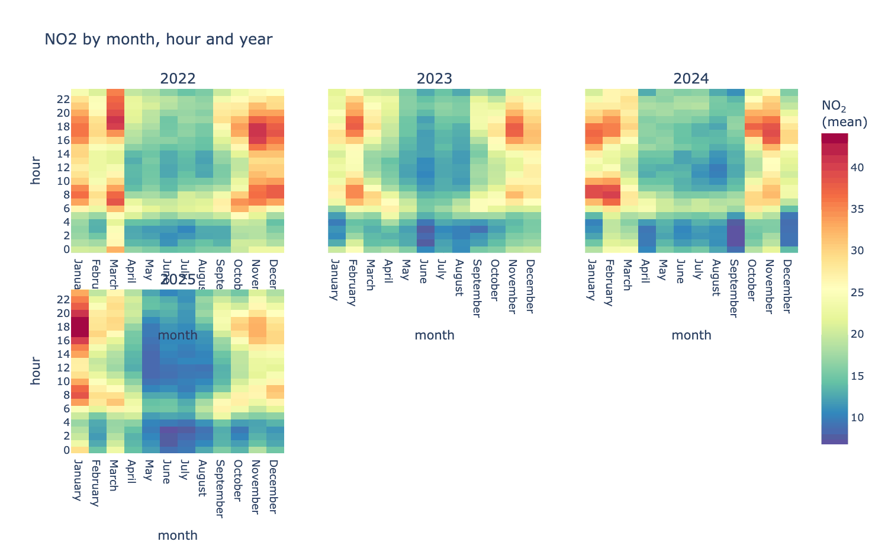</p>

```python
from PythonAQ import trend_level

fig, summary = trend_level(df, 'NO2', x='month', y='hour', type='year')
```

- `x`, `y` (str): axes, from `'hour'`, `'weekday'`, `'month'`, `'year'`,
  `'season'`, `'monthyear'`, `'wd'`, or any column.
- `type` (str or None): panel variable; `None` for a single panel.
- `statistic` (str): `'mean'`, `'median'`, `'max'`, `'min'` or `'frequency'`.

### `calendar`

Daily values as a calendar heat map. Needs the `calendar` extra.

<p align="center">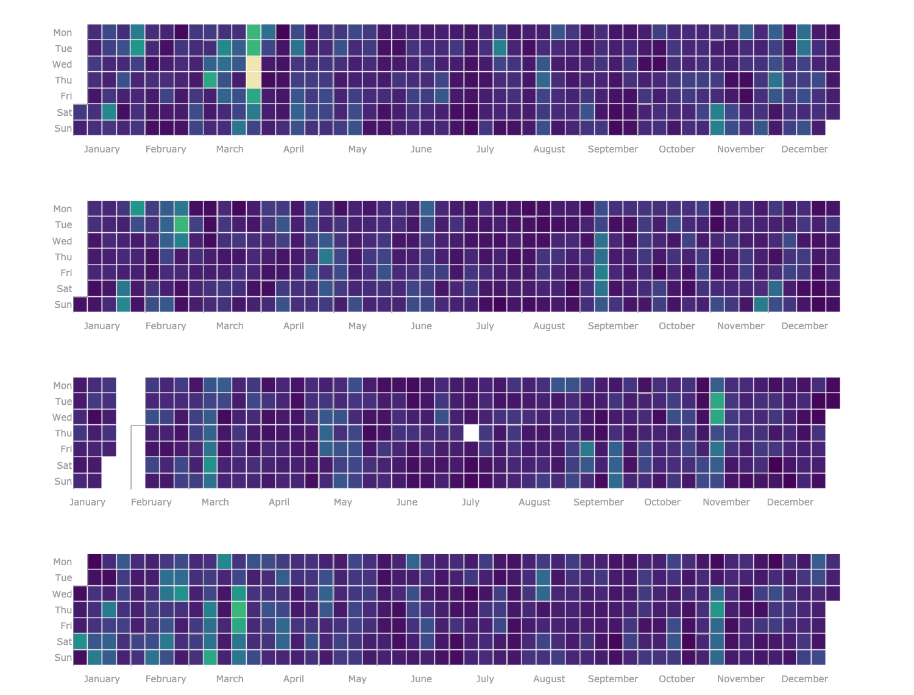</p>

```python
from PythonAQ import calendar

calendar(df, value_column='PM10').show()
```

---

## Distributions and relationships

### `summary_plot`

Time series, data-capture rug and histogram for every pollutant at once — the
first thing to run on an unfamiliar dataset.

<p align="center">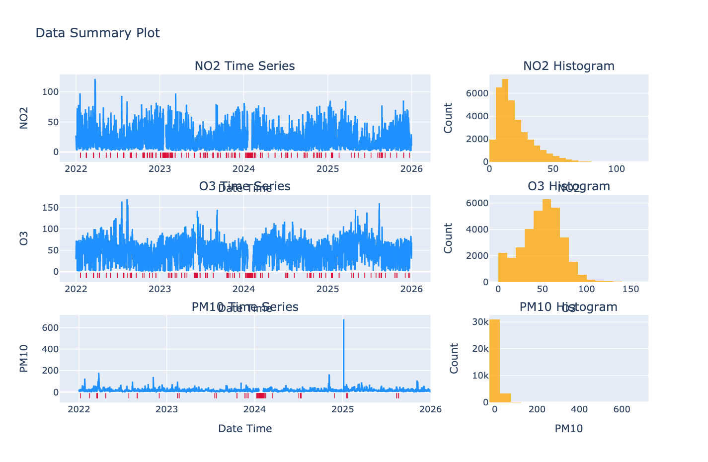</p>

```python
from PythonAQ import summary_plot

fig, summary = summary_plot(df[['date_time', 'NO2', 'PM10', 'O3']])
```

The summary `DataFrame` gives capture rate, missing count, min, max, mean,
median and 95th percentile per column.

### `scatter_plot`

Two variables against each other, with optional linear and LOWESS fits.

<p align="center">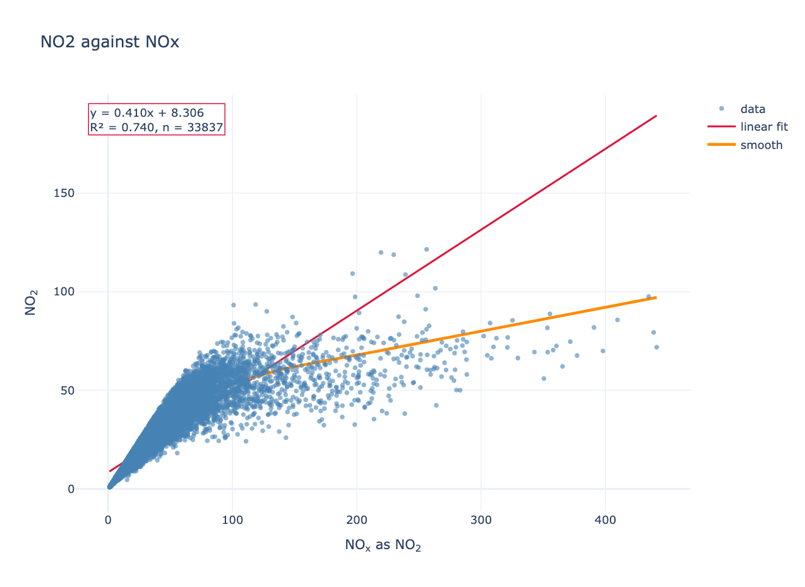</p>

```python
from PythonAQ import scatter_plot

fig, fit = scatter_plot(df, 'NOXasNO2', 'NO2', linear=True, smooth=True)
```

For Leeds Centre this gives NO₂ = 0.410 × NOₓ + 8.31, R² = 0.740. The slope
below one and the curvature in the LOWESS fit reflect NO₂ making up a smaller
share of NOₓ as total NOₓ rises, since the oxidant available to convert NO is
limited.

- `method` (str): `'scatter'`, `'hexbin'` or `'density'`.
- `colour_by` (str): column used to colour points.
- `linear` (bool), `smooth` (bool), `one_to_one` (bool): overlays.

Returns the figure and a `DataFrame` of fit statistics.

### `corr_plot`

Correlation matrix, ordered by hierarchical clustering so related species sit
together.

<p align="center">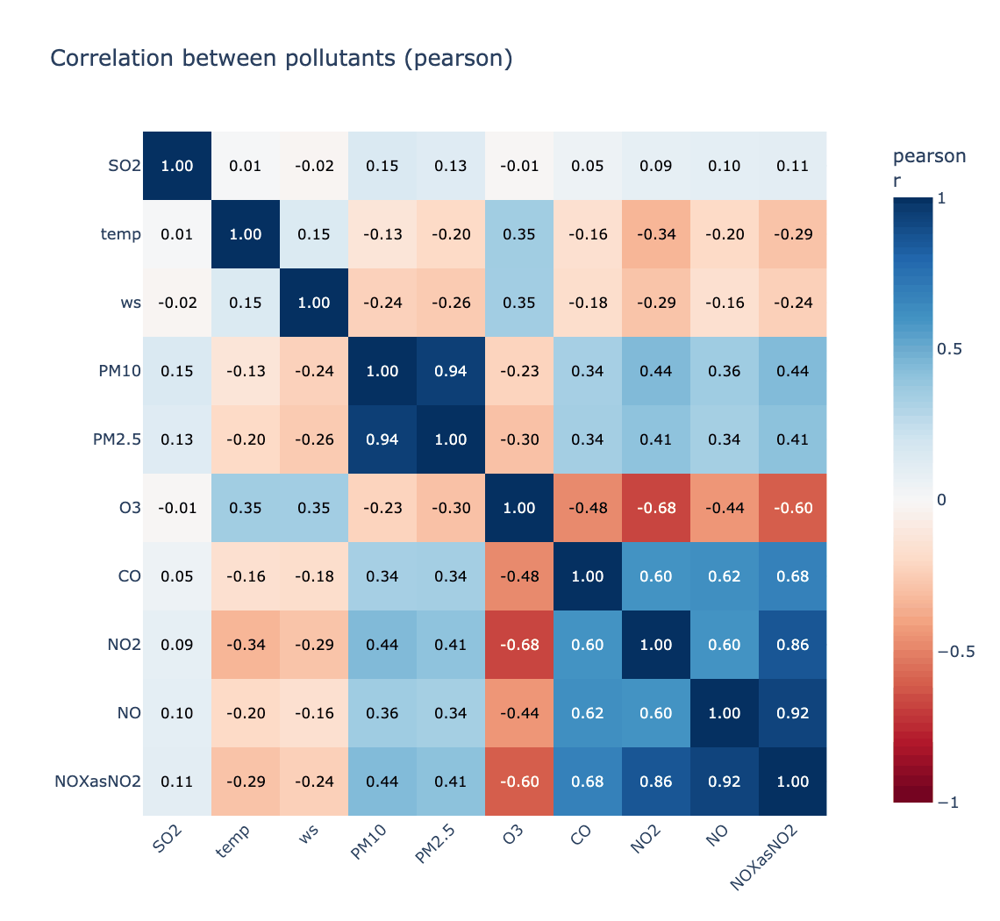</p>

```python
from PythonAQ import corr_plot

fig, corr = corr_plot(df, ['NO', 'NO2', 'NOXasNO2', 'O3', 'PM10', 'PM2.5'])
```

Strongest pair here is PM10/PM2.5 at r = 0.943; strongest anticorrelation is
O₃ against NO₂ at r = −0.676.

- `method` (str): `'pearson'`, `'spearman'` or `'kendall'`.
- `cluster` (bool), `annotate` (bool).

---

## Model evaluation

### `mod_stats`

Standard statistics for comparing modelled against observed values. The
formulas follow the openair R source exactly, including the piecewise index of
agreement of Willmott et al. (2011).

```python
from PythonAQ import mod_stats

stats = mod_stats(df, mod='model', obs='observed', group_by='season')
```

Returns `n`, `FAC2`, `MB`, `MGE`, `NMB`, `NMGE`, `RMSE`, `r`, `P`, `COE`, `IOA`.

| Statistic | Meaning |
|---|---|
| `FAC2` | Fraction of predictions within a factor of two |
| `MB`, `MGE` | Mean bias, mean gross error |
| `NMB`, `NMGE` | The same, normalised by the sum of observations |
| `RMSE` | Root mean square error |
| `r`, `P` | Pearson correlation and its p-value |
| `COE` | 1 is perfect, 0 is no better than the observed mean, negative is worse |
| `IOA` | Index of agreement, −1 to +1 |

### `aq_stats`

Annual summary statistics with exceedance counts against the UK objectives.

```python
from PythonAQ import aq_stats

summary = aq_stats(df, 'NO2', data_thresh=75)
```

For Leeds Centre:

| year | data capture | mean | median | 95th pct | max daily | hours > 200 |
|---|---|---|---|---|---|---|
| 2022 | 97.6 | 22.2 | 18.3 | 50.5 | 66.5 | 0 |
| 2023 | 95.7 | 19.1 | 15.4 | 47.0 | 52.6 | 0 |
| 2024 | 93.7 | 19.2 | 15.8 | 45.6 | 49.0 | 0 |
| 2025 | 99.0 | 18.6 | 14.4 | 46.8 | 61.1 | 0 |

---

## Data utilities

### `time_average`

Average over a period, honouring a data-capture threshold.

```python
from PythonAQ import time_average

daily = time_average(df, avg_time='day', data_thresh=75)
```

- `avg_time` (str): `'hour'`, `'day'`, `'3 day'`, `'month'`, `'year'`, or any
  pandas offset alias.
- `data_thresh` (float): minimum percentage of data required in a period;
  periods below become `NaN`.
- `statistic` (str): `'mean'`, `'median'`, `'max'`, `'min'`, `'sum'`, `'sd'`,
  `'frequency'`, `'data.cap'` or `'percentile'`.

> **Wind direction is averaged as a vector**, not a scalar. Winds at 350° and
> 10° average to 0°, due north, rather than the 180° a naive mean would give.
> The scalar mean wind speed is kept; pass `vector_ws=True` for the vector
> magnitude.

### `select_by_date`

Subset by date components; all criteria combine with AND.

```python
from PythonAQ import select_by_date

subset = select_by_date(df, year=2024, month='June', day=['Sat', 'Sun'])
winter = select_by_date(df, season='winter')
```

`month` takes names or numbers; `day` takes weekday names or month-days.

### `rolling_mean`

Rolling mean with a data-capture threshold. The 8-point default matches the
running 8-hour mean used for ozone.

```python
from PythonAQ import rolling_mean

result = rolling_mean(df, 'O3', width=8, data_thresh=75)
```

- `align` (str): `'centre'`, `'left'` or `'right'`.

### `cut_data`

Add a conditioning column for splitting data.

```python
from PythonAQ import cut_data

tagged = cut_data(df, type='season')
```

- `type` (str): `'year'`, `'month'`, `'monthyear'`, `'season'`, `'seasonyear'`,
  `'weekday'`, `'weekend'`, `'hour'`, `'daylight'`, `'wd'`, or a numeric column
  name (split into `n_levels` quantiles).
- `hemisphere` (str): `'northern'` or `'southern'`, for season definitions.

### `calc_percentile`

Percentiles of a pollutant over a period.

```python
from PythonAQ import calc_percentile

result = calc_percentile(df, 'NO2', percentile=[25, 50, 75, 95], avg_time='month')
```

### `deseason_data` and `get_period`

Remove a seasonal cycle by decomposition.

```python
from PythonAQ import deseason_data, get_period

ds = deseason_data(df, pollutant_column='NO2', interval='7D',
                   period=get_period('7D'), method='additive')
```

`get_period` converts a pandas interval string into the number of periods in a
year, which is what the decomposition needs.

---

## Meteorological helpers

### `e_sat` and `rh`

Saturation vapour pressure (hPa) and relative humidity (%).

```python
from PythonAQ import e_sat, rh

e_sat(20.0)        # 23.34 hPa
rh(20.0, 10.0)     # 52.5 %
rh(15.0, 15.0)     # 100.0 %, saturated
```

Both take scalars or arrays. `rh` expects air temperature and dew point in °C
and clips the result to 0–100.

---

## Relationship to openair

PythonAQ follows openair using Python naming conventions — `timeVariation`
becomes `time_variation`. Where a statistic has a precise definition, such as
the `modStats` metrics, the formulas follow the openair R source exactly.

| openair | PythonAQ | | openair | PythonAQ |
|---|---|---|---|---|
| `importAURN` etc. | `download_aurn_data` | | `timeAverage` | `time_average` |
| `importMeta` | `import_aq_meta` | | `selectByDate` | `select_by_date` |
| `windRose` | `wind_rose` | | `rollingMean` | `rolling_mean` |
| `pollutionRose` | `pollutant_rose` | | `cutData` | `cut_data` |
| `percentileRose` | `percentile_rose` | | `calcPercentile` | `calc_percentile` |
| `polarPlot` | `polar_plot` | | `modStats` | `mod_stats` |
| `polarFreq` | `polar_frequency_plot` | | `aqStats` | `aq_stats` |
| `polarCluster` | `polar_cluster` | | `corPlot` | `corr_plot` |
| `timePlot` | `time_plot` | | `scatterPlot` | `scatter_plot` |
| `timeVariation` | `time_variation` | | `trendLevel` | `trend_level` |
| `TheilSen` | `theil_sen_plot` | | `calendarPlot` | `calendar` |
| `smoothTrend` | `smooth_trend_plot` | | | |

**Not yet ported:** `polarAnnulus`, `polarDiff`, `timeProp`, `TaylorDiagram`,
`conditionalQuantile`, `conditionalEval`, `distPlot`, the trajectory functions
(`trajPlot`, `trajLevel`, `trajCluster`), and the remaining smoothers
(`GaussianSmooth`, `WhittakerSmooth`, `kzFilter`).

**Two deliberate differences:**

- `time_average` averages wind direction as a vector but keeps the *scalar*
  mean wind speed. Pass `vector_ws=True` for the vector magnitude.
- `cut_data(type='daylight')` uses a fixed 07:00–19:00 window rather than
  openair's solar elevation calculation. Adequate for coarse splits; replace it
  before relying on it at high latitude or near the solstices.

---

## Worked example

[`examples/demo_leeds.py`](examples/demo_leeds.py) runs **every** public
function against real data for Leeds Centre and writes each figure to
`examples/output/` as standalone interactive HTML:

```bash
pip install -e '.[calendar]'
python examples/demo_leeds.py
```

It downloads ~35,000 hourly records plus meteorology from the nearest NOAA
station, caches them so re-runs are instant, and checks its own coverage —
exiting non-zero if any public function goes unexercised. Pass `--refresh` to
re-download.

### Streamlit application

```bash
pip install -e '.[app,calendar]'
streamlit run app.py
```

---

## Development

```bash
pip install -e '.[dev]'
pytest
```

The tests use synthetic data throughout and never touch the network, so they run
offline and deterministically. CI covers Python 3.9–3.13 on Linux, plus macOS
and Windows.

To rebuild the figures in this manual after changing a plotting function:

```bash
pip install -e '.[calendar,docs]'
python examples/build_readme_figures.py
```

---

## Contributing

Contributions are welcome — please open an issue or pull request.

## Licence

MIT. See [LICENSE](LICENSE).
